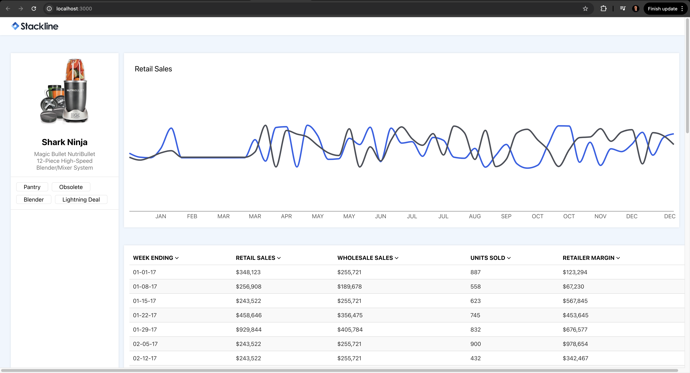

# Stackline Assessment Challenge
This is a Frontend assessement for Stackline.

## Installation Instructions

Install dependencies

```
npm install
```

Run the app in development mode

```
npm run dev
```

Open onn browser

```
http://localhost:3000/
```

### Assets to be returned via email within the provided time frame:

1.  A [public repository](https://github.com/SusyQinqinYang/Stackline-fe-oa) to view the code
2.  

## Thank You